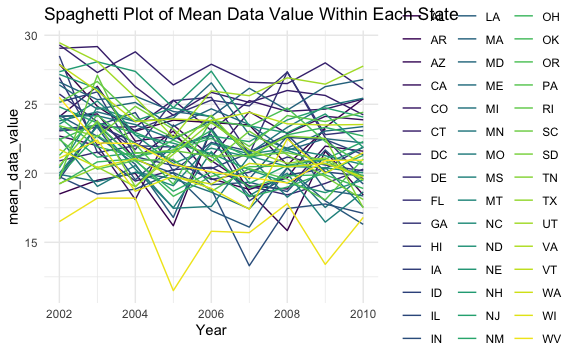
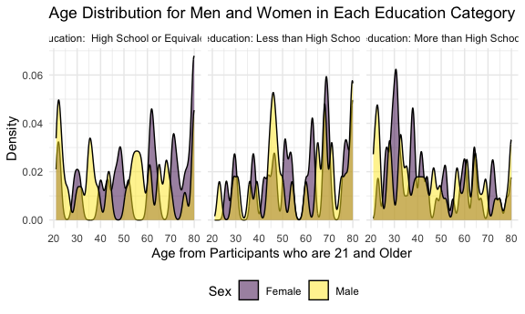
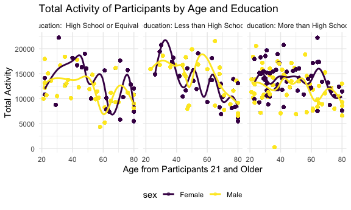

Homework 3
================
Youssra Yemmas
2023-10-14

# Problem 1

``` r
data("instacart")
summary(instacart)
```

    ##     order_id         product_id    add_to_cart_order   reordered     
    ##  Min.   :      1   Min.   :    1   Min.   : 1.000    Min.   :0.0000  
    ##  1st Qu.: 843370   1st Qu.:13380   1st Qu.: 3.000    1st Qu.:0.0000  
    ##  Median :1701880   Median :25298   Median : 7.000    Median :1.0000  
    ##  Mean   :1706298   Mean   :25556   Mean   : 8.758    Mean   :0.5986  
    ##  3rd Qu.:2568023   3rd Qu.:37940   3rd Qu.:12.000    3rd Qu.:1.0000  
    ##  Max.   :3421070   Max.   :49688   Max.   :80.000    Max.   :1.0000  
    ##     user_id         eval_set          order_number      order_dow    
    ##  Min.   :     1   Length:1384617     Min.   :  4.00   Min.   :0.000  
    ##  1st Qu.: 51732   Class :character   1st Qu.:  6.00   1st Qu.:1.000  
    ##  Median :102933   Mode  :character   Median : 11.00   Median :3.000  
    ##  Mean   :103113                      Mean   : 17.09   Mean   :2.701  
    ##  3rd Qu.:154959                      3rd Qu.: 21.00   3rd Qu.:5.000  
    ##  Max.   :206209                      Max.   :100.00   Max.   :6.000  
    ##  order_hour_of_day days_since_prior_order product_name          aisle_id    
    ##  Min.   : 0.00     Min.   : 0.00          Length:1384617     Min.   :  1.0  
    ##  1st Qu.:10.00     1st Qu.: 7.00          Class :character   1st Qu.: 31.0  
    ##  Median :14.00     Median :15.00          Mode  :character   Median : 83.0  
    ##  Mean   :13.58     Mean   :17.07                             Mean   : 71.3  
    ##  3rd Qu.:17.00     3rd Qu.:30.00                             3rd Qu.:107.0  
    ##  Max.   :23.00     Max.   :30.00                             Max.   :134.0  
    ##  department_id      aisle            department       
    ##  Min.   : 1.00   Length:1384617     Length:1384617    
    ##  1st Qu.: 4.00   Class :character   Class :character  
    ##  Median : 8.00   Mode  :character   Mode  :character  
    ##  Mean   : 9.84                                        
    ##  3rd Qu.:16.00                                        
    ##  Max.   :21.00

``` r
length(instacart)
```

    ## [1] 15

``` r
nrow(instacart)
```

    ## [1] 1384617

``` r
ncol(instacart)
```

    ## [1] 15

``` r
skimr::skim(instacart)
```

|                                                  |           |
|:-------------------------------------------------|:----------|
| Name                                             | instacart |
| Number of rows                                   | 1384617   |
| Number of columns                                | 15        |
| \_\_\_\_\_\_\_\_\_\_\_\_\_\_\_\_\_\_\_\_\_\_\_   |           |
| Column type frequency:                           |           |
| character                                        | 4         |
| numeric                                          | 11        |
| \_\_\_\_\_\_\_\_\_\_\_\_\_\_\_\_\_\_\_\_\_\_\_\_ |           |
| Group variables                                  | None      |

Data summary

**Variable type: character**

| skim_variable | n_missing | complete_rate | min | max | empty | n_unique | whitespace |
|:--------------|----------:|--------------:|----:|----:|------:|---------:|-----------:|
| eval_set      |         0 |             1 |   5 |   5 |     0 |        1 |          0 |
| product_name  |         0 |             1 |   3 | 159 |     0 |    39123 |          0 |
| aisle         |         0 |             1 |   3 |  29 |     0 |      134 |          0 |
| department    |         0 |             1 |   4 |  15 |     0 |       21 |          0 |

**Variable type: numeric**

| skim_variable          | n_missing | complete_rate |       mean |        sd |  p0 |    p25 |     p50 |     p75 |    p100 | hist  |
|:-----------------------|----------:|--------------:|-----------:|----------:|----:|-------:|--------:|--------:|--------:|:------|
| order_id               |         0 |             1 | 1706297.62 | 989732.65 |   1 | 843370 | 1701880 | 2568023 | 3421070 | ▇▇▇▇▇ |
| product_id             |         0 |             1 |   25556.24 |  14121.27 |   1 |  13380 |   25298 |   37940 |   49688 | ▆▆▇▆▇ |
| add_to_cart_order      |         0 |             1 |       8.76 |      7.42 |   1 |      3 |       7 |      12 |      80 | ▇▁▁▁▁ |
| reordered              |         0 |             1 |       0.60 |      0.49 |   0 |      0 |       1 |       1 |       1 | ▆▁▁▁▇ |
| user_id                |         0 |             1 |  103112.78 |  59487.15 |   1 |  51732 |  102933 |  154959 |  206209 | ▇▇▇▇▇ |
| order_number           |         0 |             1 |      17.09 |     16.61 |   4 |      6 |      11 |      21 |     100 | ▇▂▁▁▁ |
| order_dow              |         0 |             1 |       2.70 |      2.17 |   0 |      1 |       3 |       5 |       6 | ▇▂▂▂▆ |
| order_hour_of_day      |         0 |             1 |      13.58 |      4.24 |   0 |     10 |      14 |      17 |      23 | ▁▃▇▇▃ |
| days_since_prior_order |         0 |             1 |      17.07 |     10.43 |   0 |      7 |      15 |      30 |      30 | ▅▅▃▂▇ |
| aisle_id               |         0 |             1 |      71.30 |     38.10 |   1 |     31 |      83 |     107 |     134 | ▆▃▃▇▆ |
| department_id          |         0 |             1 |       9.84 |      6.29 |   1 |      4 |       8 |      16 |      21 | ▇▂▂▅▂ |

From an initial summarizing look at the data instacart there are
1,384,617 observations of 15 variables with 4 variables that are
categorical and 11 that are numerical. There also seems to be one binary
variable, reordered, that corresponds to if an item is ordered again or
not. Ther variables order day of the week and order hour of the day are
interesting and show a median of 3 for day of the week meaning Wednesday
is a day clients most often place their orders and with a median of 14
for hour of the day it seems most orders are places at 2 pm.

# Problem 1 cont.-how many aisles are there and which aisles are the most items ordered from

``` r
instacart |> 
  count(aisle) |> 
  arrange(desc(n))
```

    ## # A tibble: 134 × 2
    ##    aisle                              n
    ##    <chr>                          <int>
    ##  1 fresh vegetables              150609
    ##  2 fresh fruits                  150473
    ##  3 packaged vegetables fruits     78493
    ##  4 yogurt                         55240
    ##  5 packaged cheese                41699
    ##  6 water seltzer sparkling water  36617
    ##  7 milk                           32644
    ##  8 chips pretzels                 31269
    ##  9 soy lactosefree                26240
    ## 10 bread                          23635
    ## # ℹ 124 more rows

``` r
instacart1_df =
instacart %>% 
  janitor::clean_names() %>% 
  group_by(aisle_id, aisle) %>% 
  summarize(n_obs = n())
```

    ## `summarise()` has grouped output by 'aisle_id'. You can override using the
    ## `.groups` argument.

We can see from the subsetted data frame that there are 134 aisles and
using the toggle arrows when viewing the instacart1_df we can see that
some of the aisles where most items are ordered from are the fresh
vegetables, fresh fruits, packaged vegetables fruits, yoghurt and
packaged cheese aisles.

# Making a plot with number of items ordered in each aisle, filtering to aisles with more than 10000 items ordered

``` r
instacart |> 
  count(aisle) |> 
  filter(n > 10000) |> 
  mutate(aisle = fct_reorder(aisle, n)) |> 
  ggplot(aes(x = aisle, y = n)) + 
  geom_point(aes(color = aisle)) + 
  labs(title = "Number of items ordered in each aisle") +
  theme(axis.text.x = element_text(angle = 60, hjust = 1))
```


``` r
instacart1_df %>% 
  count(aisle) %>% 
  filter(n > 10000) %>% 
  mutate(
    aisle_id = as.factor(aisle),
    aisle_id = fct_reorder(aisle, n)
  )
```

    ## # A tibble: 0 × 3
    ## # Groups:   aisle_id [0]
    ## # ℹ 3 variables: aisle_id <fct>, aisle <chr>, n <int>

``` r
aisles_plot =
instacart1_df %>% 
  ggplot(aes(x = aisle_id, y = n_obs)) +
  geom_histogram(stat = "identity") +
  labs(title = "Number of Items Ordered in Each Aisle", x = "Name of Aisles", y = "Number of Items Ordered")
```

    ## Warning in geom_histogram(stat = "identity"): Ignoring unknown parameters:
    ## `binwidth`, `bins`, and `pad`

``` r
aisles_plot
```


# Making a table showing the most popular items in each of the aisles baking ingredients, dog food care, and packaged vegetables fruits including the number of times each is ordered

``` r
instacart |> 
  filter(aisle %in% c("baking ingredients", "dog food care", "packaged vegetables fruits")) |>
  group_by(aisle) |> 
  count(product_name) |> 
  mutate(rank = min_rank(desc(n))) |> 
  filter(rank < 4) |> 
  arrange(desc(n)) |>
  knitr::kable()
```

| aisle                      | product_name                                  |    n | rank |
|:---------------------------|:----------------------------------------------|-----:|-----:|
| packaged vegetables fruits | Organic Baby Spinach                          | 9784 |    1 |
| packaged vegetables fruits | Organic Raspberries                           | 5546 |    2 |
| packaged vegetables fruits | Organic Blueberries                           | 4966 |    3 |
| baking ingredients         | Light Brown Sugar                             |  499 |    1 |
| baking ingredients         | Pure Baking Soda                              |  387 |    2 |
| baking ingredients         | Cane Sugar                                    |  336 |    3 |
| dog food care              | Snack Sticks Chicken & Rice Recipe Dog Treats |   30 |    1 |
| dog food care              | Organix Chicken & Brown Rice Recipe           |   28 |    2 |
| dog food care              | Small Dog Biscuits                            |   26 |    3 |

This creates a data frame where we can toggle through and see that in
the aisle baking ingredients the two most ordered items are Light Brown
Sugar which was ordered 157 times and Pure Baking Soda which was ordered
140 times; in the aisle dog food care the two most ordered items in dog
food care are Organix Grain Free Chicken & Vegetable Dog Food which was
ordered 14 times and Organix Chicken & Brown Rice Recipe whcih was
ordered 13 times and lastly in packaged vegetables fruits the two most
ordered items are Organic Baby Spinach which was ordered 3324 times and
Organic Raspberries which was ordered 1920 times.

# Making a data frame showing the mean hour of the day at which Pink Lady Apples and Coffee Ice Cream are ordered on each day of the week

``` r
mean_hour_df = 
  instacart %>% 
  filter(product_name %in% c("Pink Lady Apples", "Coffee Ice Cream")) %>% 
  group_by(product_name, order_dow) %>% 
  summarize(mean_hour = mean(order_hour_of_day)) %>% 
  pivot_wider(
    names_from = order_dow,
    values_from = mean_hour
  ) %>% 
  knitr::kable(digits = 2)
```

    ## `summarise()` has grouped output by 'product_name'. You can override using the
    ## `.groups` argument.

From the data we can see that the mean hour of the day at which the
items Pink Lady Apples and Coffee Ice Cream are ordered each day of the
week.

# Problem 2

### First will need to focus on Overall Health Topic, including only responses from Excellent to Poor and organize the responses as a factor taking levels ordered from Poor to Excellent

``` r
data("brfss_smart2010")
summary(brfss_smart2010)
```

    ##       Year      Locationabbr       Locationdesc          Class          
    ##  Min.   :2002   Length:134203      Length:134203      Length:134203     
    ##  1st Qu.:2005   Class :character   Class :character   Class :character  
    ##  Median :2007   Mode  :character   Mode  :character   Mode  :character  
    ##  Mean   :2007                                                           
    ##  3rd Qu.:2009                                                           
    ##  Max.   :2010                                                           
    ##                                                                         
    ##     Topic             Question           Response          Sample_Size    
    ##  Length:134203      Length:134203      Length:134203      Min.   :   1.0  
    ##  Class :character   Class :character   Class :character   1st Qu.:  59.0  
    ##  Mode  :character   Mode  :character   Mode  :character   Median : 153.0  
    ##                                                           Mean   : 271.7  
    ##                                                           3rd Qu.: 353.0  
    ##                                                           Max.   :4505.0  
    ##                                                           NA's   :2       
    ##    Data_value    Confidence_limit_Low Confidence_limit_High Display_order 
    ##  Min.   : 0.10   Min.   : 0.00        Min.   :  0.00        Min.   : 1.0  
    ##  1st Qu.:14.30   1st Qu.: 8.50        1st Qu.: 16.30        1st Qu.:16.0  
    ##  Median :33.20   Median :25.90        Median : 37.00        Median :32.0  
    ##  Mean   :43.23   Mean   :37.74        Mean   : 45.76        Mean   :32.4  
    ##  3rd Qu.:77.30   3rd Qu.:71.10        3rd Qu.: 81.55        3rd Qu.:48.0  
    ##  Max.   :99.90   Max.   :99.70        Max.   :100.00        Max.   :68.0  
    ##  NA's   :4515                                                             
    ##  Data_value_unit    Data_value_type    Data_Value_Footnote_Symbol
    ##  Length:134203      Length:134203      Length:134203             
    ##  Class :character   Class :character   Class :character          
    ##  Mode  :character   Mode  :character   Mode  :character          
    ##                                                                  
    ##                                                                  
    ##                                                                  
    ##                                                                  
    ##  Data_Value_Footnote  DataSource          ClassId            TopicId         
    ##  Length:134203       Length:134203      Length:134203      Length:134203     
    ##  Class :character    Class :character   Class :character   Class :character  
    ##  Mode  :character    Mode  :character   Mode  :character   Mode  :character  
    ##                                                                              
    ##                                                                              
    ##                                                                              
    ##                                                                              
    ##   LocationID         QuestionID           RESPID          GeoLocation       
    ##  Length:134203      Length:134203      Length:134203      Length:134203     
    ##  Class :character   Class :character   Class :character   Class :character  
    ##  Mode  :character   Mode  :character   Mode  :character   Mode  :character  
    ##                                                                             
    ##                                                                             
    ##                                                                             
    ## 

``` r
janitor::clean_names(brfss_smart2010)
```

    ## # A tibble: 134,203 × 23
    ##     year locationabbr locationdesc     class topic question response sample_size
    ##    <int> <chr>        <chr>            <chr> <chr> <chr>    <chr>          <int>
    ##  1  2010 AL           AL - Jefferson … Heal… Over… How is … Excelle…          94
    ##  2  2010 AL           AL - Jefferson … Heal… Over… How is … Very go…         148
    ##  3  2010 AL           AL - Jefferson … Heal… Over… How is … Good             208
    ##  4  2010 AL           AL - Jefferson … Heal… Over… How is … Fair             107
    ##  5  2010 AL           AL - Jefferson … Heal… Over… How is … Poor              45
    ##  6  2010 AL           AL - Jefferson … Heal… Fair… Health … Good or…         450
    ##  7  2010 AL           AL - Jefferson … Heal… Fair… Health … Fair or…         152
    ##  8  2010 AL           AL - Jefferson … Heal… Heal… Do you … Yes              524
    ##  9  2010 AL           AL - Jefferson … Heal… Heal… Do you … No                77
    ## 10  2010 AL           AL - Jefferson … Heal… Unde… Adults … Yes              316
    ## # ℹ 134,193 more rows
    ## # ℹ 15 more variables: data_value <dbl>, confidence_limit_low <dbl>,
    ## #   confidence_limit_high <dbl>, display_order <int>, data_value_unit <chr>,
    ## #   data_value_type <chr>, data_value_footnote_symbol <chr>,
    ## #   data_value_footnote <chr>, data_source <chr>, class_id <chr>,
    ## #   topic_id <chr>, location_id <chr>, question_id <chr>, respid <chr>,
    ## #   geo_location <chr>

``` r
brfss_smart2010_df =
brfss_smart2010 %>% 
  filter(Topic %in% c("Overall Health")) %>% 
  group_by(Response) %>% 
  mutate(
    Response = factor(Response, levels = c("Poor", "Fair", "Good", "Very Good", "Excellent"))
  ) %>% 
  arrange(Response)
```

### In 2002, which states were observed at 7 or more locations? What about in 2010?

``` r
location_2002_df = 
  brfss_smart2010_df %>% 
  filter(Year == 2002) %>% 
  group_by(Locationabbr) %>% 
  summarize(
    n_obs = n(),
    n_locations = n_distinct(Locationdesc)
  ) %>% 
  filter(n_locations >= 7) %>% 
  select(Locationabbr)
 knitr::kable(location_2002_df)
```

| Locationabbr |
|:-------------|
| CT           |
| FL           |
| MA           |
| NC           |
| NJ           |
| PA           |

``` r
# We can see that in 2002 the states Connecticut, Florida, Massachusetts, North Carolina, New Jersey and Pennsylvania were observed at 7 or mopre locations.
 
location_2010_df = 
  brfss_smart2010_df %>% 
  filter(Year == 2010) %>% 
  group_by(Locationabbr) %>% 
  summarize(
    n_obs = n(),
    n_locations = n_distinct(Locationdesc)
  ) %>% 
  filter(n_locations >= 7) %>% 
  select(Locationabbr)
 knitr::kable(location_2010_df)
```

| Locationabbr |
|:-------------|
| CA           |
| CO           |
| FL           |
| MA           |
| MD           |
| NC           |
| NE           |
| NJ           |
| NY           |
| OH           |
| PA           |
| SC           |
| TX           |
| WA           |

``` r
# We can see that in 2010 the states California, Colorado, Florida, Massachusetts, Maryland, North Carolina, Nebraska, New Jersey, New York, Ohio, Pennsylvania, South Carolina, Texas and Washington were observed at 7 or mopre locations.
```

# Constructing a dataset that is limited to Excellent responses, and contains, year, state, and a variable that averages the data_value across locations within a state. Make a “spaghetti” plot of this average value over time within a state (that is, make a plot showing a line for each state across years – the geom_line geometry and group aesthetic will help).

``` r
excellent_df = 
  brfss_smart2010_df %>% 
  filter(Response == "Excellent") %>% 
  select(Year, Locationabbr, Data_value) %>% 
  group_by(Locationabbr, Year) %>% 
  mutate(
    mean_data_value = mean(Data_value, na.rm = TRUE)
  )
```

    ## Adding missing grouping variables: `Response`

``` r
excellent_plot =
  ggplot(excellent_df, aes(x = Year, y = mean_data_value, group = Locationabbr, color = Locationabbr)) +
  geom_line() +
  labs(title = "Spaghetti Plot of Mean Data Value Within Each State", x = "Year", Y = "Mean Values", color = "State")
excellent_plot
```



# Making a two-panel plot showing, for the years 2006, and 2010, distribution of data_value for responses (“Poor” to “Excellent”) among locations in NY State.

``` r
nystate_2006_df = 
  brfss_smart2010_df %>% 
  filter(Locationabbr == "NY", Year == "2006") %>% 
  drop_na(Response)

nystate_2010_df = 
  brfss_smart2010_df %>% 
  filter(Locationabbr == "NY", Year == "2010") %>% 
  drop_na(Response)

nystate_0610_df =
  full_join(nystate_2006_df, nystate_2010_df)
```

    ## Joining with `by = join_by(Year, Locationabbr, Locationdesc, Class, Topic,
    ## Question, Response, Sample_Size, Data_value, Confidence_limit_Low,
    ## Confidence_limit_High, Display_order, Data_value_unit, Data_value_type,
    ## Data_Value_Footnote_Symbol, Data_Value_Footnote, DataSource, ClassId, TopicId,
    ## LocationID, QuestionID, RESPID, GeoLocation)`

``` r
nystate0610_plot = 
  ggplot(nystate_0610_df, aes(x = Response, y = Data_value, color = Locationabbr)) +
  geom_point() 
nystate0610_plot + facet_grid(Response ~ Year)
```


# Problem 3 Starting with reading the NHANES Accelerometer Data and wrangling the data

``` r
nhanes_acceler_data = 
  read_csv("./nhanes_accel.csv") %>% 
  janitor::clean_names() %>% 
  pivot_longer(
    cols = c(min1:min1440),
    names_to = "minute",
    names_prefix = "min",
    values_to = "mims"
  ) 
```

    ## Rows: 250 Columns: 1441
    ## ── Column specification ────────────────────────────────────────────────────────
    ## Delimiter: ","
    ## dbl (1441): SEQN, min1, min2, min3, min4, min5, min6, min7, min8, min9, min1...
    ## 
    ## ℹ Use `spec()` to retrieve the full column specification for this data.
    ## ℹ Specify the column types or set `show_col_types = FALSE` to quiet this message.

``` r
# Now I will read the demographic data and try to tidy it with the end goal in mind of merging both data sets with the first obvious issue being that this data set does not have the column names until 5 lines down so I have to skip those first 4 lines and then reconfigure the data to be non-numeric but rather factors that have multiple levels.
nhanes_demo_data = 
  read_csv("./nhanes_covar.csv", skip = 4) %>% 
  janitor::clean_names() %>% 
  mutate(
    sex = 
      case_match(sex, 1 ~ "Male", 2 ~ "Female"),
    sex = as.factor(sex),
    education =
      case_match(education, 1 ~ "Less than High School", 2 ~ " High School or Equivalent", 3 ~ "More than High School"),
    education = as.factor(education)
  )
```

    ## Rows: 250 Columns: 5
    ## ── Column specification ────────────────────────────────────────────────────────
    ## Delimiter: ","
    ## dbl (5): SEQN, sex, age, BMI, education
    ## 
    ## ℹ Use `spec()` to retrieve the full column specification for this data.
    ## ℹ Specify the column types or set `show_col_types = FALSE` to quiet this message.

# Attempting to Merge the two data sets

The aim for the final data frame is that all originally observed
variables are included; exclude participants less than 21 years of age,
and those with missing demographic data; and encode data with reasonable
variable classes (i.e. not numeric, and using factors with the ordering
of tables and plots in mind).

``` r
final_nhanes_df =
  full_join(nhanes_acceler_data, nhanes_demo_data) %>% 
  filter(age > 20) %>% 
  drop_na(sex, age, bmi, education)
```

    ## Joining with `by = join_by(seqn)`

``` r
is.factor(final_nhanes_df$sex)
```

    ## [1] TRUE

``` r
is.factor(final_nhanes_df$education)
```

    ## [1] TRUE

``` r
skimr::skim(final_nhanes_df)
```

|                                                  |                 |
|:-------------------------------------------------|:----------------|
| Name                                             | final_nhanes_df |
| Number of rows                                   | 328320          |
| Number of columns                                | 7               |
| \_\_\_\_\_\_\_\_\_\_\_\_\_\_\_\_\_\_\_\_\_\_\_   |                 |
| Column type frequency:                           |                 |
| character                                        | 1               |
| factor                                           | 2               |
| numeric                                          | 4               |
| \_\_\_\_\_\_\_\_\_\_\_\_\_\_\_\_\_\_\_\_\_\_\_\_ |                 |
| Group variables                                  | None            |

Data summary

**Variable type: character**

| skim_variable | n_missing | complete_rate | min | max | empty | n_unique | whitespace |
|:--------------|----------:|--------------:|----:|----:|------:|---------:|-----------:|
| minute        |         0 |             1 |   1 |   4 |     0 |     1440 |          0 |

**Variable type: factor**

| skim_variable | n_missing | complete_rate | ordered | n_unique | top_counts                         |
|:--------------|----------:|--------------:|:--------|---------:|:-----------------------------------|
| sex           |         0 |             1 | FALSE   |        2 | Mal: 169920, Fem: 158400           |
| education     |         0 |             1 | FALSE   |        3 | Mor: 165600, Hi: 83520, Les: 79200 |

**Variable type: numeric**

| skim_variable | n_missing | complete_rate |     mean |     sd |      p0 |      p25 |      p50 |      p75 |     p100 | hist  |
|:--------------|----------:|--------------:|---------:|-------:|--------:|---------:|---------:|---------:|---------:|:------|
| seqn          |         0 |             1 | 62439.22 | 154.04 | 62161.0 | 62301.75 | 62442.50 | 62571.25 | 62704.00 | ▇▇▇▇▇ |
| mims          |         0 |             1 |     8.89 |   7.25 |     0.0 |     2.35 |     8.04 |    13.81 |   103.48 | ▇▁▁▁▁ |
| age           |         0 |             1 |    50.48 |  18.60 |    21.0 |    33.00 |    49.50 |    67.00 |    80.00 | ▇▇▅▇▇ |
| bmi           |         0 |             1 |    29.41 |   6.89 |    16.5 |    24.08 |    28.00 |    33.52 |    56.30 | ▅▇▅▁▁ |

# Producing a reader-friendly table for the number of men and women in each education category

``` r
sex_edu_table = 
  final_nhanes_df %>% 
  select(sex, education) %>% 
  group_by(sex, education) %>% 
  summarize(count = n()) %>% 
  knitr::kable()
```

    ## `summarise()` has grouped output by 'sex'. You can override using the `.groups`
    ## argument.

``` r
sex_edu_table
```

| sex    | education                 | count |
|:-------|:--------------------------|------:|
| Female | High School or Equivalent | 33120 |
| Female | Less than High School     | 40320 |
| Female | More than High School     | 84960 |
| Male   | High School or Equivalent | 50400 |
| Male   | Less than High School     | 38880 |
| Male   | More than High School     | 80640 |

``` r
# There seems to be more Men than Women who have a High School or Equivalent Degree (50400 and 33120 respectively), there is about the same number of Men and Women who have Less Than a High School degree (38880 and 40320 respectively) but proportionally there seems to be a greater proportion of women who have less than a high school degree. In terms of higher education there is more women who have more than a high school degree. 
```

# A plot of the age distribution for men and women in each education category

``` r
sex_edu_age_plot = 
  ggplot(final_nhanes_df, aes(x = age, fill = sex)) +
  geom_density(alpha = .5, adjust = .5) +
  labs(
    title = "Age Distribution for Men and Women in Each Education Category",
    x = "Age from Participants who are 21 and Older ",
    y = "Density", 
    fill = "Sex"
  ) + 
  facet_grid(.~education, labeller = label_both) +
  scale_x_continuous(
    breaks = c(10, 20, 30, 40, 50, 60, 70, 80)
  )
           
sex_edu_age_plot 
```



``` r
# There seems to be a lot of peaks in the distribution for all of the educational categories for both men and women. In the High school or equivalent educational category it seems for Women older age groups of around 60-70 years are predominant whereas for men it is more concentrated in younger age groups. In the Less than high school educational category there is a peak of 40-50 years old for men and one around 70 years old for women. In the More than High School Educational Category it seems both mean and women have the same peak in the younger age groups between 20-30.Interestingly, the distributions for both sexes in the Less than High School category and the More than High School category are skewed concordantly whereas for the High School or Equivalent educational category the distributions are skewed oppositionaly with the Male distribution being almost left skewed and the female one being right skewed. 
```

# Creating a total activity variable

``` r
nhanes_total_act_df = 
  final_nhanes_df %>% 
  group_by(seqn) %>% 
  mutate(
    total_activity = sum(mims)
  )
```

# Plotting the total activity

``` r
total_activity_plot = 
  ggplot(nhanes_total_act_df, aes(x = age, y = total_activity, color = sex)) +
  geom_point(alpha = .5) +
  geom_smooth(se = FALSE) +
  facet_grid(.~ education, labeller = label_both) +
  labs(
    title = "Total Activity of Participants by Age and Education",
    x = "Age from Participants 21 and Older",
    y = "Total Activity"
  )

total_activity_plot
```

    ## `geom_smooth()` using method = 'gam' and formula = 'y ~ s(x, bs = "cs")'


